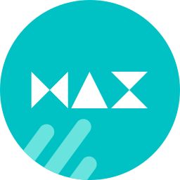

<h1 align="center"> Yosa-Max-Git </h1>

 <b> Yosa Max Icon Theme (previously Yosa Mix Icon Theme) </b> 

  

<h3 align="center"> <i> A free-form, bright, and clear icon theme while maintaining some subtlety. </i> </h3>

  

 
This icon theme is originally based on the popular la capitaine icon theme, with a different kind of style to differentiate it from the original one.

## Feel free to contribute to this project.
You can add new icons or modify/change/improve the existing icons.
There are no strict guidelines or rules on creating new icons for this icon theme. As long as it looks good and matches the other icons, then that's it.
I'll always be happy to receive any kind of contributions.

<i>Please consider to add a png-preview files of your new icons, see [documentations](/documentations) directory.</i>
